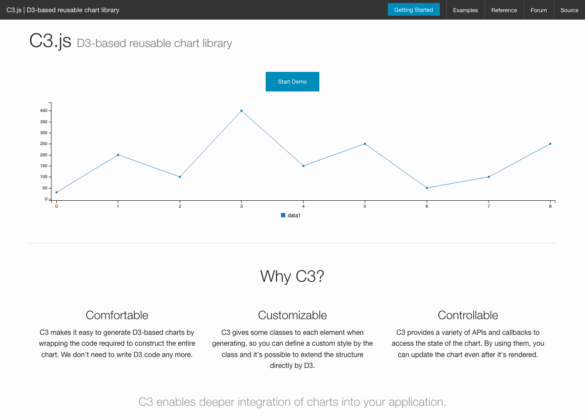

For graphing out datasets that only need a basic graph, I tend to use [C3.js](https://c3js.org). It is based upon D3 but without the hassle of putting all of the SVGs together.

It simplifies it down to inserting your datapoints and then configuring it with a straightforward set of options. I've both created [Clarkson University's Mirror Stats page](https://mirror.clarkson.edu/stats.html) as well as the [VS Code Issue Tracker](https://vscode-issue-tracker.netlify.com) with C3.

