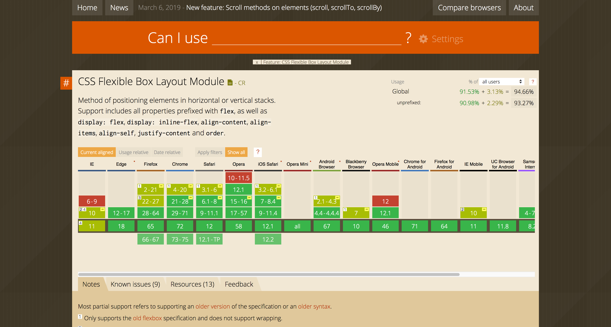

As browsers continue to bring in new web features, it would benefit one to check if a feature is widely supported or has a [Polyfill](https://developer.mozilla.org/en-US/docs/Glossary/Polyfill) before implementing it into websites one would develop. As such, Can I Use is a platform that shows tables to preview the browser support of a new web platform feature. Visit it over at https://caniuse.com

