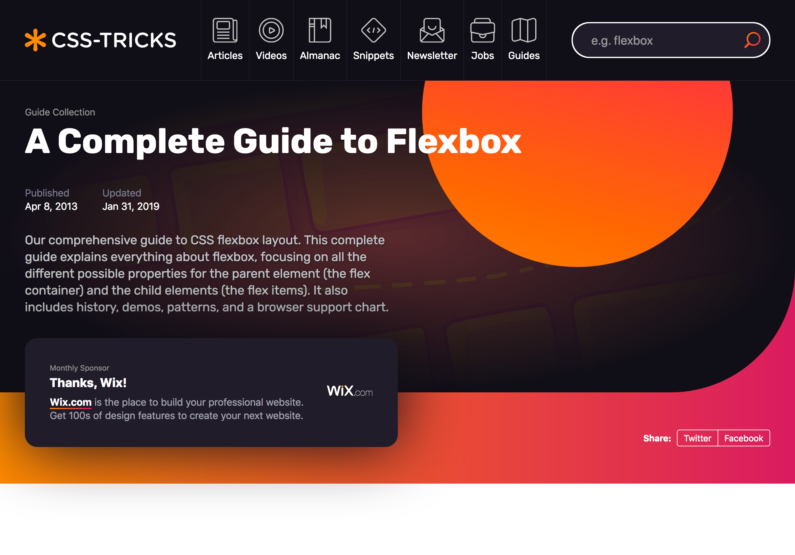

Flexbox is one of the more powerful modern tools for laying items out in web pages. With that, having a visual guide to Flexbox is handy given you want to visually see how css rules related to flex box will actually look. Chris Coyier's (Creator of CSS Tricks & NPM) guide on Flexbox does exactly this:

