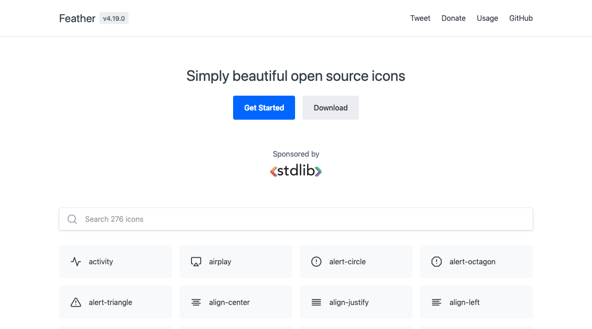

I tend to use the [Feather](https://feathericons.com/) icon set when I need icons. It provides a small set of open icons that can either be used with a simple JS library or downloaded individually as SVGs.

