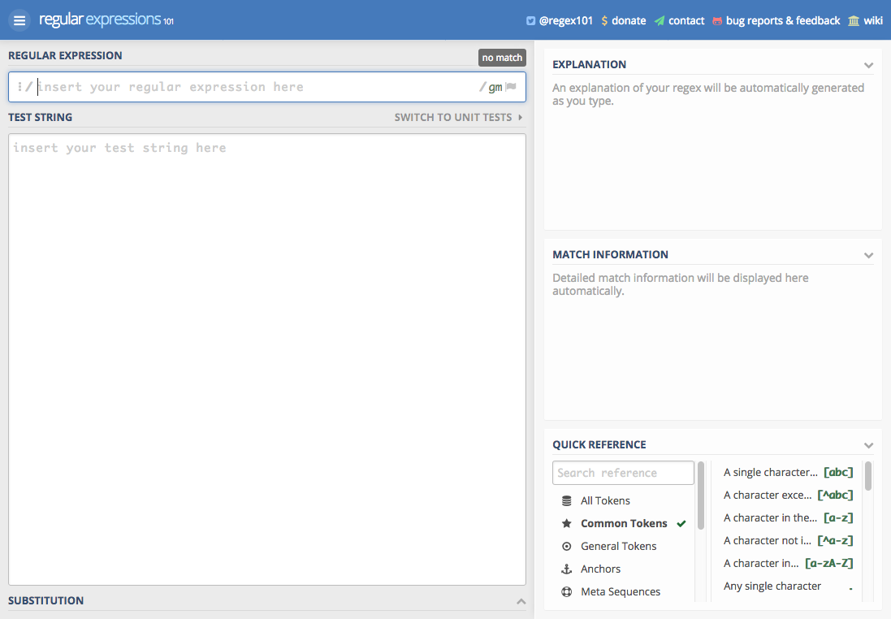

Parsing through sets of data can be a good use case for regular expressions, but a lot of people have stated that the syntax can get convoluted and confusing. The main resource I use when writing regular expressions is [Regex101](https://regex101.com/)

It allows you to put content to test upon and create regular expressions and see the matches and groups the regex will capture. Regex101 supports Javascript, Python, PHP, and Go and supports code generation to insert the regex into your programs in the language you chose.
