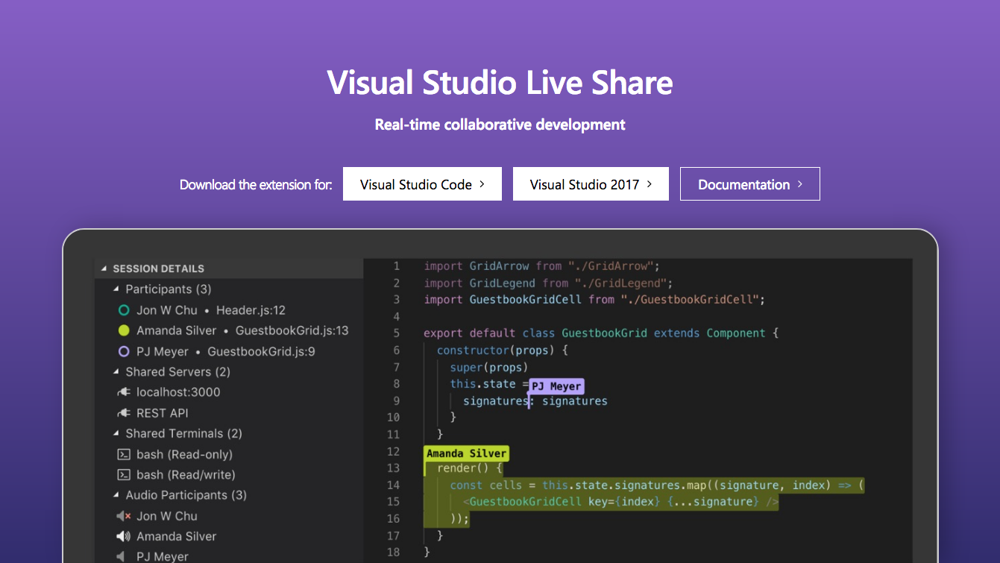

[VS Live Share](https://visualstudio.microsoft.com/services/live-share/) is a platform for instant collaborative development using the Visual Studio family of editors. The easiest way to describe it is comparing it to how Google Docs revolutionized collaborative document editing, VS Live Share does similar for collaborative coding. With it, you can use either Visual Studio on Windows or Visual Studio Code on Windows, Linux, or Mac, and work with others in a shared workspace. You share the entire workspace, terminals, live servers, debugging tools, and other capabilities with additonal extensions.

With VS Live Share, it hasn't been easier to give access to another developer to try tackling a project together even if you aren't in the same location. You open a session, send another individual or individuals a URL and they are instantly inserted into your workspace using their tools of choice.

And for an added bonus, if you use Visual Studio 2019, it is built into the editor by default.
